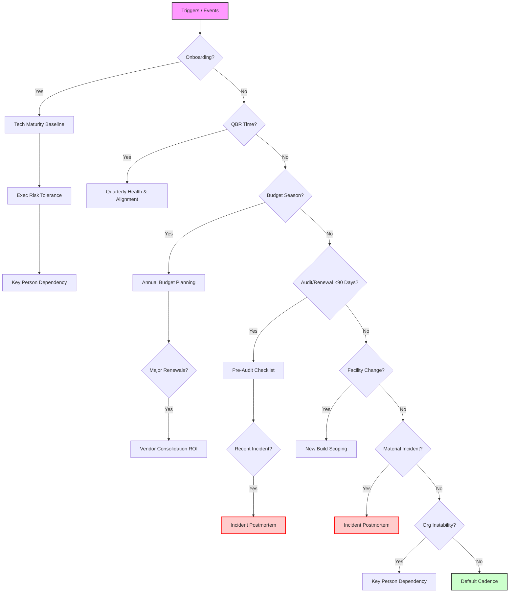
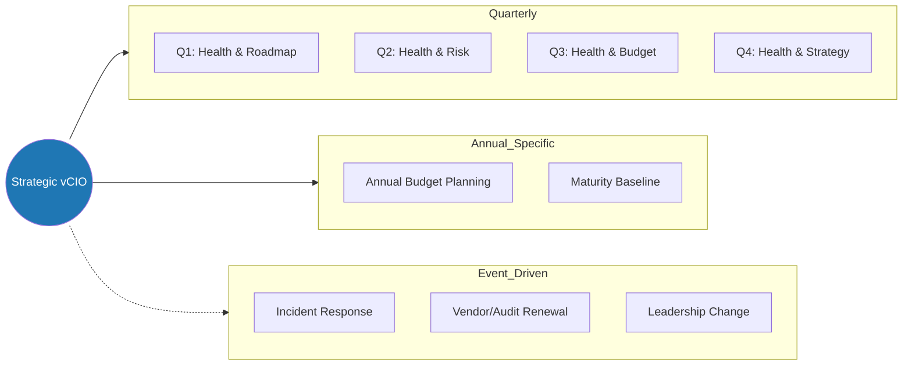

# vCIO Lifecycle Visuals & Toolkit

## 1. Internal vCIO Triage Flowchart
_Use this flowchart to quickly determine the correct assessment trigger._

---

## 2. Client-Facing Lifecycle Graphic
_Share this to explain the vCIO engagement model._

---

## 3. Deliverable Checklist Mapping

| Questionnaire / Assessment | Primary Deliverable | Secondary Outcome |
|----------------------------|---------------------|-------------------|
| **Technology Maturity Baseline** | Current State Report (Scores) | Gap Analysis for Roadmap |
| **Executive Risk Tolerance** | Risk Tolerance Statement | IT Policy Adjustments |
| **Quarterly Health & Alignment** | QBR Deck / Satisfaction Score | Priority Readjustment |
| **Key Person Dependency** | Knowledge Transfer Plan | Access Control Audit |
| **Vendor Consolidation ROI** | Savings Proposal | Shadow IT Discovery |
| **Incident Postmortem** | Root Cause Analysis (RCA) | Process Improvement Plan |
| **Annual Budget Planning** | 1-3 Year Budget Forecast | Capital Improvement Plan |

---
