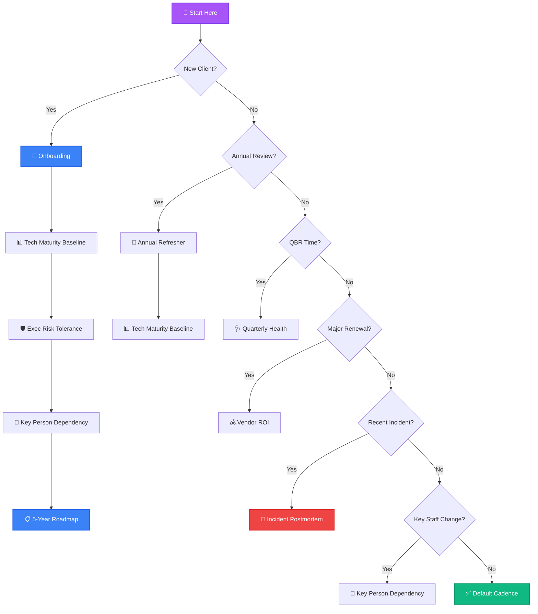
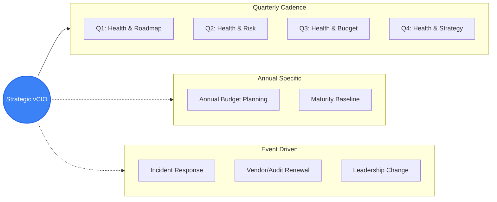

# vCIO Questionnaire Decision Tree

*Document Version: 2.0*

Use this guide to determine which assessment to run based on client lifecycle stage or trigger events.

---

## 1. Decision Flowchart

---

## 2. vCIO Engagement Model (Lifecycle Graphic)

---

## 3. Deliverable Checklist Mapping

| Questionnaire / Assessment | Primary Deliverable | Secondary Outcome |
|---|---|---|
| Technology Maturity Baseline | Current State Report (Scores) | Gap Analysis for Roadmap |
| Executive Risk Tolerance | Risk Tolerance Statement | IT Policy Adjustments |
| Quarterly Health & Alignment | QBR Deck / Satisfaction Score | Priority Readjustment |
| Key Person Dependency | Knowledge Transfer Plan | Access Control Audit |
| Vendor Consolidation ROI | Savings Proposal | Shadow IT Discovery |
| Incident Postmortem | Root Cause Analysis (RCA) | Process Improvement Plan |
| Annual Budget Planning | 1-3 Year Budget Forecast | Capital Improvement Plan |

---

## 4. All Available Assessments

### Core Strategy
| Assessment | Description |
|---|---|
| 📋 5-Year Strategic Roadmap | Long-term IT vision & roadmap |
| 🚀 Onboarding / Account Takeover | New client discovery & baseline |
| 🔄 Annual Strategy Refresher | Yearly check-in on priorities |

### Lifecycle Assessments
| Assessment | Description |
|---|---|
| 🩺 Quarterly Health & Alignment | QBR alignment check |
| 📊 Technology Maturity Baseline | Technical posture scoring |
| 🛡️ Executive Risk Tolerance | Define risk appetite |
| 👥 Key Person Dependency | Bus factor analysis |
| 💰 Vendor Consolidation & ROI | License/vendor optimization |
| 🚨 Incident Postmortem | Root cause analysis |
